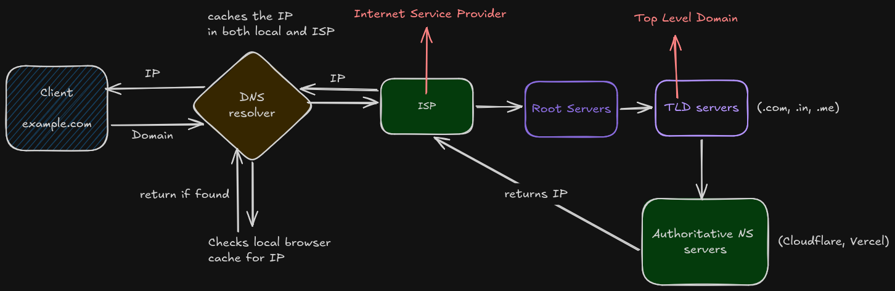

## DNS 

## Proxy vs Reverse Proxy

**Forward Proxy**: Hides the client from the server. e.g VPN. Usecases include privacy, content filtering and bypassing geo-restrictions.

**Reverse Proxy**: Hides the server from the client, e.g Nginx. It handles SSL termination, caching, compression and load balancing.

