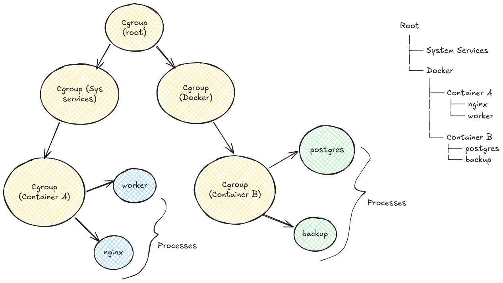

A cgroup is a group of processes that Linux manages together. Instead of setting CPU limits for every process individually, Linux says:

> All these processes belong to container A. Treat them as one group

# Why is this useful? 

Suppose two applications are running simultaneously:

Application A - uses 100% of the CPU
Application B - slows down a lot

To prevent this, we can assign resource limits to each cgroup that application belongs to and therefore, each can use the CPU without slowing down the other.

e.g 
	Application A cgroup - limit CPU 50%
	Application B cgroup - limit CPU 50%
	
Now, both gets CPU time.
# Components of  a cgroup

A cgroup consists of two major components: 
- the core - manages the hierarchical tree structure
	- creating, deleting cgroups
	- moving processes between cgroups
	- parent-child relationships
- controllers - enforces resource distribution
	- every controller is independent of the other
	- each controller handles only one resource i.e (memory, cpu, disk i/o, network.)
	- controllers are hierarchical.
	- controllers can be enabled or disabled for a cgroup

## Important points about Cgroups:

- Cgroups form a tree structure and can therefore, be nested.
- Every process belongs to only one cgroup
- All threads of a process belong to the same cgroup as the process
- A child process inherits the same cgroup from its parent when created.
- A process can be migrated to other cgroups, without affecting its children. They still remain in the previous cgroup. 
- Resource limits flow from parent to child. A child cgroup can make limits **stricter**, but it **cannot override or exceed** limits imposed by its ancestors. This enforces the 'controllers are hierarchical concept'.
	- For e.g: 
		In the image above,
			if docker CPU limit = 60%:
			and:
				container A cpu limit = 80%
				container B cpu limit = 20%
			then:
				container A gets 80% of 60% = 48% of actual CPU 
				container B gets 20% of 60% = 12% of actual CPU