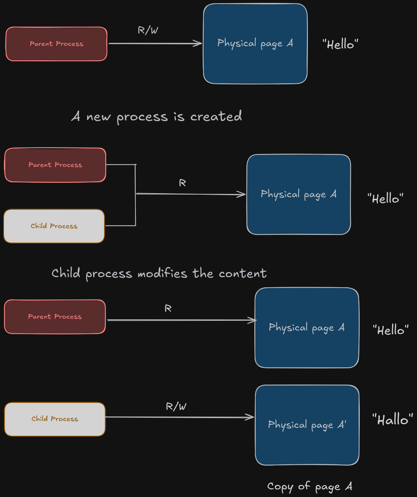

When a new process is created (for e.g in fork), the OS assigns read-only access to the parent's memory pages in the page tables of both the parent and the child.

- This way the parent and the child both only have read permissions to those memory pages.
- Now it waits for the `first write`. Whichever process does the first write, a page fault is detected for the process, a new memory page is allocated copying the contents of the original memory page and the modifying process is mapped to this copied page with read-write permissions.
### Questions answered:

- Why is the parent's permission also updated to read-only after the child is created?
	 This is because CoW depends on the first write and based on that assigns write permissions to the modifying process. If the parent already had write permissions, it won't be able to detect the first write if the parent makes any kind of modification to the memory pages. Also, this modification can be seen by the child process which will violate the semantics of a fork(), i.e each process has its own independent address space.

- Can the parent also be assigned a copy of the original memory page if it is the one modifying it?
	 Yes, because CoW only cares about the first write and whichever process does it gets a copy of that memory page with modified data and r/w permissions. The original memory page is still shared among the other processes with read-only permissions. If no process is mapped to that memory page, the OS destroys it.